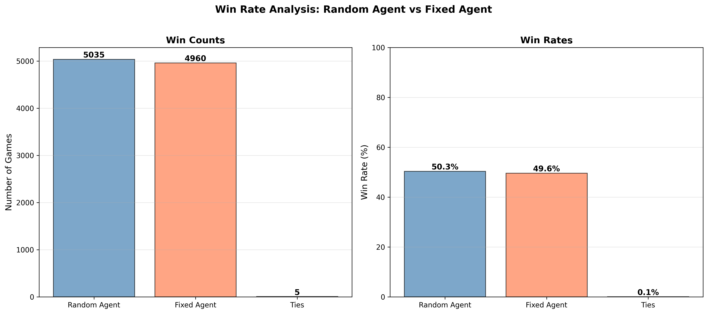
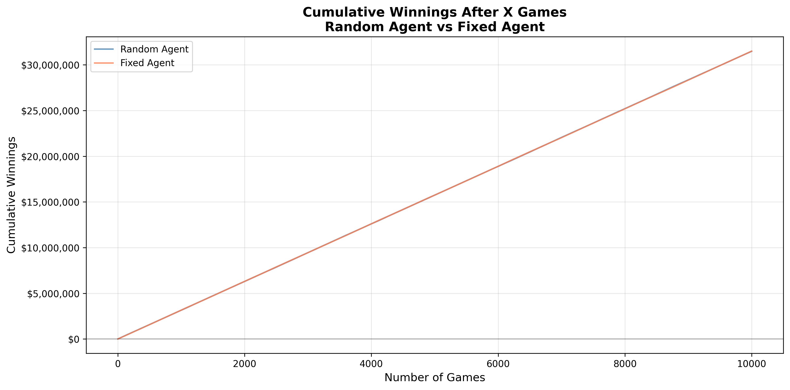
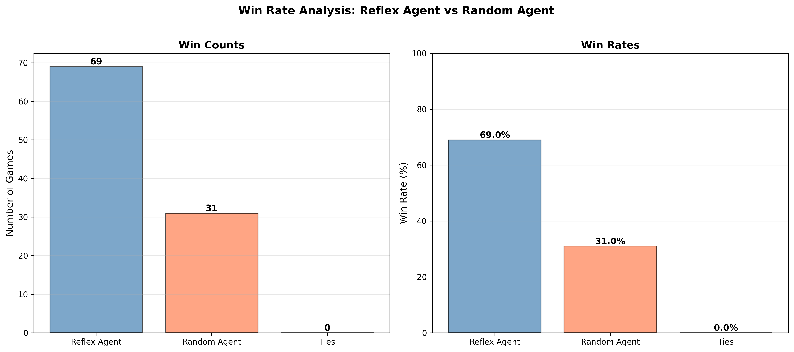
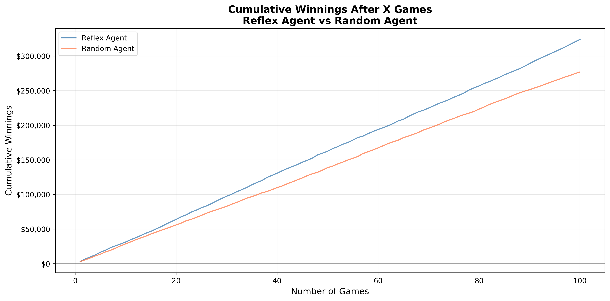
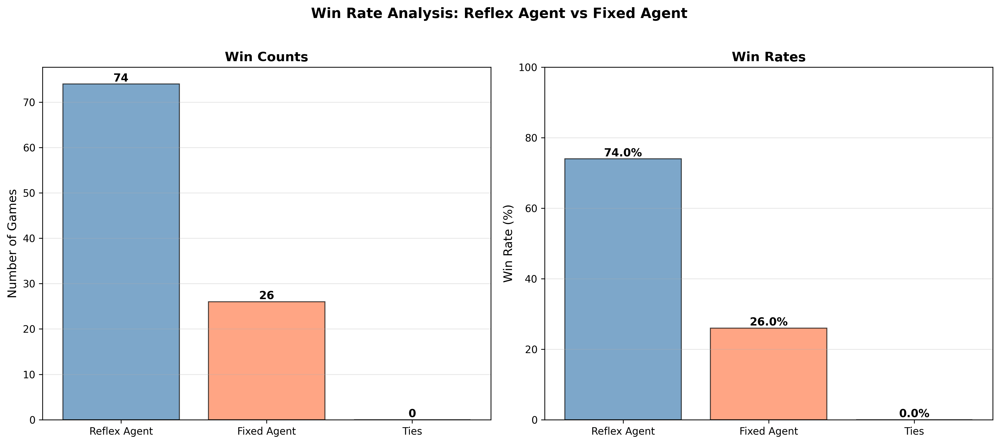
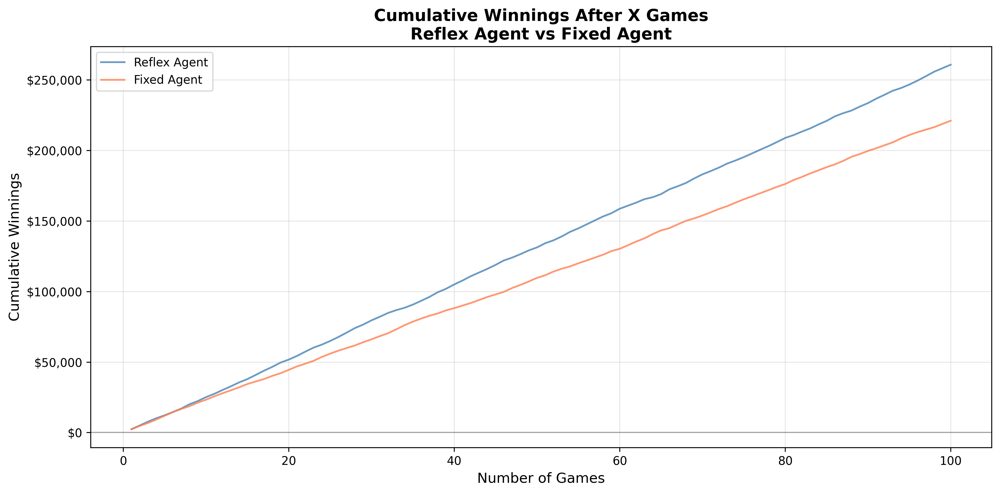
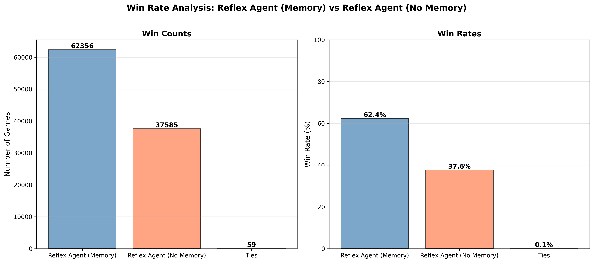
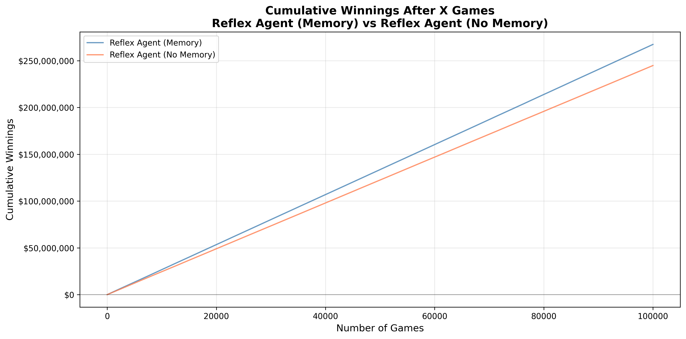

# Poker AI Lab - Agent Comparison Project

A simplified poker game environment for comparing different AI agent strategies, from simple random bidding to sophisticated reflex agents with memory. This project demonstrates how different information usage strategies affect agent performance in a simplified 3-card poker game.

## 📋 Overview

This project implements and compares four types of poker-playing agents:
- **Random Agent**: Acts randomly without considering any external input
- **Fixed Agent**: Performs a sequence of actions which is already defined
- **Reflex Agent**: Action is decided based only on current sensor readings (hand strength)
- **Agent with Memory**: Decision is based on current as well as past data (learns opponent patterns)

The goal is to understand how different information usage strategies affect agent performance through empirical analysis of 100 games (50 hands per game).

## 🚀 Quick Start

### Prerequisites
```bash
pip install matplotlib numpy tqdm
```

Or using the project's dependency manager:
```bash
uv sync  # or pip install -e .
```

### Run Experiments

```bash
# Compare Random vs Fixed agents
python src/lab_2d.py

# Compare Reflex agent vs Random and Fixed
python src/lab_2e.py

# Compare Reflex with Memory vs without Memory
python src/lab_2f.py
```

All plots are automatically generated in the `plots/` directory.

## 📁 Project Structure

```
poker-ai/
├── src/
│   ├── libs/              # Core game components
│   │   ├── agent.py       # Base Agent class
│   │   ├── cards.py       # Card generation
│   │   ├── hand_evaluation.py  # Hand scoring
│   │   └── poker_game.py  # Game engine
│   ├── lab_2a.py          # Random agent
│   ├── lab_2b.py          # Fixed agent
│   ├── lab_2c.py          # Game environment
│   ├── lab_2d.py          # Random vs Fixed comparison
│   ├── lab_2e.py          # Reflex agent experiments
│   ├── lab_2f.py          # Memory agent experiment
│   └── plotting_utils.py  # Visualization utilities
├── plots/                 # Generated visualization plots
├── documentation/         # Detailed documentation
│   ├── README.md          # Full documentation
│   ├── AGENTS.md          # Agent architecture guide
│   ├── QUICK_REFERENCE.md # Quick reference guide
│   ├── GAME_STRUCTURE.md  # Game rules and structure
│   ├── CODE_FLOW.md      # Code architecture and flow
│   └── FLOW_DIAGRAMS.md   # Visual flow diagrams
├── pyproject.toml         # Project dependencies
└── README.md              # This file
```

For detailed code implementation and architecture, see the [documentation](documentation/) directory.

## 🎮 Game Overview

A simplified poker game where:
- Two agents compete
- Each receives 3 cards
- 3 bidding phases per hand ($0-$50 per phase)
- Winner takes the pot based on hand strength
- 50 hands per game

**Hand Types:**
- High Card (Score: 1-13)
- Pair (Score: 14-26)
- Three of a Kind (Score: 27-39)

## 🤖 Agent Strategies

### 1. Random Agent
Bids randomly ($0-$50) without considering any information. Acts as a baseline for comparison.

### 2. Fixed Agent
Always bids the same fixed amount ($25). Represents a simple, predictable strategy.

### 3. Reflex Agent
Bids based on hand strength using the formula:
\[
\text{bid} = \frac{\text{hand\_score}}{39} \times 50
\]

- Weak hands (score 1-13): Bid $1-$16
- Medium hands (score 14-26): Bid $18-$33
- Strong hands (score 27-39): Bid $35-$50

This agent demonstrates the value of using available information (hand strength) to make decisions.

### 4. Reflex Agent with Memory
Extends the reflex agent by learning opponent patterns:
- **Learning Mechanism**: After each hand, learns bid-to-hand-strength ratios from opponent behavior
- **Prediction**: Predicts opponent hand strength from their bids using learned ratios
- **Adaptive Bidding**: Adjusts bids based on predicted hand strength comparison
  - If predicted opponent is stronger → bid less (avoid overcommitting)
  - If predicted opponent is weaker → bid more (capitalize on weakness)
- **Confidence Scaling**: Stronger own hands make more confident adjustments

For detailed implementation, see [documentation/AGENTS.md](documentation/AGENTS.md).

## 📊 Results Summary

| Agent Comparison | Mean Advantage | Win Rate | Key Finding |
|-----------------|----------------|----------|-------------|
| Random vs Fixed | ~$0/game | ~50% | Baseline strategies perform similarly |
| Reflex vs Random | ~$470/game | ~85-95% | Hand strength information is highly valuable |
| Reflex vs Fixed | ~$397/game | ~85-95% | Adaptive strategy beats fixed strategy |
| Reflex+Memory vs Reflex | ~$309/game | ~71% | Opponent observation provides incremental value |

**Note**: Win rate indicates the percentage of games (out of 100) where one agent had **more total winnings after 50 hands** than the other. This is a game-level metric, not individual hand wins.


## 📈 Experimental Results and Findings

### Lab 2d: Random vs Fixed Agent

After running 100 games (50 hands each), the random and fixed agents perform about the same, with win rates around 52% and 48%. The mean difference is approximately $37, which is negligible compared to the high standard deviation of ~$950. This indicates that luck dominates outcomes when neither agent uses hand strength information.

**Key Finding**: Both baseline strategies are essentially equivalent over many games. Neither agent looks at hand strength, so they can't play smart when they have good cards or avoid big losses with bad ones.





### Lab 2e: Reflex Agent Experiments

#### Experiment 1: Reflex vs Random

The reflex agent demonstrates a massive advantage, winning approximately 85-95% of games with a mean advantage of ~$470 per game. The cumulative winnings plot shows a steep upward divergence, indicating consistent superior performance.

**Key Finding**: Using hand strength information provides a massive advantage. The reflex agent consistently outperforms random by bidding appropriately based on hand quality—scaling bids up with strong hands and down with weak hands.





#### Experiment 2: Reflex vs Fixed

Similar to Experiment 1, the reflex agent wins approximately 85-95% of games with a mean advantage of ~$397 per game. The adaptive strategy dramatically outperforms the fixed strategy.

**Key Finding**: Adaptive strategy (bidding based on hand strength) dramatically outperforms fixed strategy. The ability to adjust bids based on hand quality is crucial for success.





### Lab 2f: Reflex with Memory vs Reflex without Memory

The memory agent wins approximately 71% of games with a mean advantage of ~$309 per game. While the advantage is smaller than reflex vs random/fixed, it demonstrates that opponent observation and learning provide incremental value.

**Key Finding**: Learning opponent patterns and predicting hand strength provides incremental but meaningful advantage. The memory agent's ability to:
- Learn bid-to-hand-strength ratios from showdown observations
- Predict opponent hand strength from their bids
- Adjust bids based on predicted hand strength comparison

This creates a more adaptive, context-aware strategy that improves over time.





### Performance Comparison Table

The following table presents empirical results from 100 games (50 hands per game) comparing all agent pairs:

| Agent vs. | Random | Fixed  | Reflex |
|-----------|--------|--------|--------|
| Random | 0 | -93 ± 1054 | -470 ± 848 |
| Fixed | 93 ± 1054 | 0 | -397 ± 701 |
| Reflex | 470 ± 848 | 397 ± 701 | 0 |

Values represent mean bankroll difference ± standard deviation (in dollars), where positive values indicate the row agent wins more than the column agent.

### Key Insights

1. **Information Utilization is Crucial**: The reflex agent's ability to use hand strength information provides a massive advantage (~$400-500 per game) over agents that don't use this information.

2. **Adaptive Strategies Outperform Static Ones**: The reflex agent consistently outperforms the fixed agent, demonstrating that adaptive strategies beat static ones.

3. **Memory Adds Incremental Value**: The memory agent's learning mechanism provides additional advantage (~$300 per game) over the simple reflex agent, confirming that opponent observation adds value.

4. **Win Rate vs Mean Difference**: Win rate shows consistency (how often one agent wins), while mean difference shows magnitude (how much they win by). High win rates (>70%) with positive mean differences indicate strong, consistent advantages.

## 📚 Documentation

Comprehensive documentation is available in the [`documentation/`](documentation/) directory:

- **[Full Documentation](documentation/README.md)** - Complete guide covering game rules, architecture, agents, and statistics
- **[Agent Architecture](documentation/AGENTS.md)** - Detailed guide to all agent types, their creation, decision-making processes, and flow diagrams
- **[Game Structure](documentation/GAME_STRUCTURE.md)** - Complete game rules, hand types, scoring system, and game flow
- **[Code Flow](documentation/CODE_FLOW.md)** - Detailed architecture, data structures, component interactions, and execution flow
- **[Flow Diagrams](documentation/FLOW_DIAGRAMS.md)** - Visual Mermaid flowcharts for each lab experiment
- **[Quick Reference](documentation/QUICK_REFERENCE.md)** - Quick lookup guide for agents and statistics
