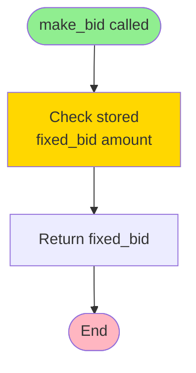

# Agent Architecture and Decision-Making

Complete documentation of all agent types, their creation, decision-making processes, and implementation details.

## Table of Contents

1. [Agent Base Class](#agent-base-class)
2. [Random Agent](#1-random-agent)
3. [Fixed Agent](#2-fixed-agent)
4. [Reflex Agent](#3-reflex-agent)
5. [Reflex Agent with Memory](#4-reflex-agent-with-memory)
6. [Agent Comparison](#agent-comparison)
7. [Creating Custom Agents](#creating-custom-agents)

---

## Agent Base Class

All agents inherit from the base `Agent` class defined in `src/libs/agent.py`.

### Class Structure

```python
class Agent:
    def __init__(self, name)
    def receive_hand(self, hand)
    def make_bid(self, phase, own_bids, opponent_bids)
    def observe_showdown(self, opponent_hand)
```

### Key Methods

- **`receive_hand(hand)`**: Called by the game engine when cards are dealt. Stores the agent's hand for the current hand.
- **`make_bid(phase, own_bids, opponent_bids)`**: **Must be implemented by subclasses**. Returns an integer bid amount ($0-50).
- **`observe_showdown(opponent_hand)`**: Optional method called after showdown. Can be used for learning from past games.

### Agent Lifecycle

```
Game Start
    ↓
receive_hand(hand)  ← Agent receives 3 cards
    ↓
make_bid(phase=1, own_bids=[], opponent_bids=[])  ← Phase 1 bidding
    ↓
make_bid(phase=2, own_bids=[bid1], opponent_bids=[opp_bid1])  ← Phase 2 bidding
    ↓
make_bid(phase=3, own_bids=[bid1, bid2], opponent_bids=[opp_bid1, opp_bid2])  ← Phase 3 bidding
    ↓
observe_showdown(opponent_hand)  ← Learn from opponent's revealed hand
    ↓
Next Hand (repeat)
```

---

## 1. Random Agent

**File**: `src/lab_2a.py`
**Factory Function**: `create_random_agent(name)`

### Overview

The Random Agent is the simplest baseline agent. It makes completely random bidding decisions without considering any information.

### Creation

```python
from lab_2a import create_random_agent

agent = create_random_agent("Random Agent")
```

### Decision-Making Flow


### Implementation

```python
class RandomAgent(Agent):
    def make_bid(self, phase, own_bids, opponent_bids):
        return random.randint(0, 50)
```

### Characteristics

- **Information Used**: None
- **Bid Range**: $0-$50 (uniform distribution)
- **Average Bid**: ~$25 per phase
- **Total Bid per Hand**: ~$75 (3 phases × $25)
- **Predictability**: Completely unpredictable
- **Use Case**: Baseline for comparison

### Decision Factors

| Factor | Considered? | Impact |
|--------|------------|--------|
| Hand strength | ❌ No | None |
| Opponent bids | ❌ No | None |
| Phase number | ❌ No | None |
| Own previous bids | ❌ No | None |

---

## 2. Fixed Agent

**File**: `src/lab_2b.py`
**Factory Function**: `create_fixed_agent(name, fixed_bid_amount=25)`

### Overview

The Fixed Agent always bids the same amount in every phase, regardless of any circumstances. This provides a predictable baseline strategy.

### Creation

```python
from lab_2b import create_fixed_agent

# Default: bids $25 per phase
agent = create_fixed_agent("Fixed Agent")

# Custom: bids $30 per phase
agent = create_fixed_agent("Fixed Agent", fixed_bid_amount=30)
```

### Decision-Making Flow



### Implementation

```python
class FixedAgent(Agent):
    def __init__(self, name, fixed_bid):
        super().__init__(name)
        self.fixed_bid = max(0, min(50, fixed_bid))  # Clamp to 0-50

    def make_bid(self, phase, own_bids, opponent_bids):
        return self.fixed_bid
```

### Characteristics

- **Information Used**: None
- **Bid Range**: Fixed amount (default: $25)
- **Bid per Phase**: Always the same (e.g., $25)
- **Total Bid per Hand**: Fixed amount × 3 (e.g., $75)
- **Predictability**: Completely predictable
- **Use Case**: Baseline for comparison, demonstrates consistency

### Decision Factors

| Factor | Considered? | Impact |
|--------|------------|--------|
| Hand strength | ❌ No | None |
| Opponent bids | ❌ No | None |
| Phase number | ❌ No | None |
| Own previous bids | ❌ No | None |
| Fixed bid amount | ✅ Yes | Determines all bids |

---

## 3. Reflex Agent

**File**: `src/lab_2e.py`
**Factory Function**: `create_reflex_agent(name)`

### Overview

The Reflex Agent makes decisions based on its own hand strength. It evaluates the hand and bids proportionally to the hand's strength.

### Creation

```python
from lab_2e import create_reflex_agent

agent = create_reflex_agent("Reflex Agent")
```

### Decision-Making Flow

```mermaid
flowchart TD
    Start([make_bid called]) --> CheckHand{Hand<br/>received?}
    CheckHand -->|No| Return0[Return $0]
    CheckHand -->|Yes| Evaluate[Evaluate hand strength<br/>using analyse_hand]

    Evaluate --> Calculate[Calculate bid:<br/>bid = hand_score / 39 * 50]
    Calculate --> Clamp[Clamp to range [0, 50]]
    Clamp --> Return[Return bid amount]

    Return0 --> End([End])
    Return --> End

    style Start fill:#90EE90
    style End fill:#FFB6C1
    style Evaluate fill:#87CEEB
    style Calculate fill:#FFD700
```

### Implementation

```python
class ReflexAgent(Agent):
    def make_bid(self, phase, own_bids, opponent_bids):
        if self.hand is None:
            return 0

        # Evaluate hand strength (score ranges from 1-39)
        hand_score = analyse_hand(self.hand)

        # Map hand score (1-39) to bid amount (0-50)
        # Linear scaling: stronger hands bid more
        bid = int((hand_score / 39.0) * 50)

        # Ensure bid is within valid range [0, 50]
        bid = max(0, min(50, bid))

        return bid
```

### Hand Strength Scoring

Hand scores range from **1-39**:

| Hand Type | Score Range | Example Scores |
|-----------|-------------|----------------|
| High Card | 1-13 | 2♠ 5♥ K♣ → Score: 12 (King) |
| Pair | 14-26 | 5♠ 5♥ 2♣ → Score: 18 (Pair of 5s) |
| Three of a Kind | 27-39 | 7♠ 7♥ 7♣ → Score: 33 (Three 7s) |

### Bidding Formula

```
bid = (hand_score / 39) × 50
```

### Bidding Ranges by Hand Strength

| Hand Strength | Score Range | Bid Range | Example |
|---------------|-------------|-----------|---------|
| Weak | 1-13 | $1-$16 | High card: 2♠ 3♥ 4♣ → Score: 4 → Bid: $5 |
| Medium | 14-26 | $18-$33 | Pair: 5♠ 5♥ 2♣ → Score: 18 → Bid: $23 |
| Strong | 27-39 | $35-$50 | Three of a kind: 7♠ 7♥ 7♣ → Score: 33 → Bid: $42 |

### Characteristics

- **Information Used**: Own hand strength
- **Bid Range**: $0-$50 (proportional to hand strength)
- **Average Bid**: Varies based on hand distribution
- **Predictability**: Predictable based on hand strength
- **Use Case**: Demonstrates value of using available information

### Decision Factors

| Factor | Considered? | Impact |
|--------|------------|--------|
| Hand strength | ✅ Yes | Primary factor - determines bid amount |
| Opponent bids | ❌ No | None |
| Phase number | ❌ No | None |
| Own previous bids | ❌ No | None |

### Example Bids

```python
# Weak hand: ["2s", "3h", "4c"]
hand_score = 4  # High card (4 is highest)
bid = (4 / 39) * 50 = $5

# Medium hand: ["5s", "5h", "2c"]
hand_score = 18  # Pair of 5s
bid = (18 / 39) * 50 = $23

# Strong hand: ["As", "Ah", "Ac"]
hand_score = 39  # Three Aces (strongest)
bid = (39 / 39) * 50 = $50
```

---

## 4. Reflex Agent with Memory

**File**: `src/lab_2f.py`
**Factory Function**: `create_reflex_agent_with_memory(name)`

### Overview

The Reflex Agent with Memory extends the Reflex Agent by learning from opponent behavior and predicting their hand strength. It uses a sophisticated learning and adjustment strategy that:
1. Starts with a base bid from hand strength (like Reflex Agent)
2. Learns bid-to-hand-strength ratios from showdown observations
3. Predicts opponent hand strength from their bids using learned ratios
4. Adjusts bid based on comparison between own and predicted opponent hand strength
5. Scales adjustments based on confidence (own hand strength)

### Creation

```python
from lab_2f import create_reflex_agent_with_memory

agent = create_reflex_agent_with_memory("Reflex Agent (Memory)")
```

### Decision-Making Flow

```mermaid
flowchart TD
    Start([make_bid called]) --> CheckHand{Hand<br/>received?}
    CheckHand -->|No| Return0[Return $0]
    CheckHand -->|Yes| Evaluate[Evaluate hand strength<br/>hand_score = analyse_hand]

    Evaluate --> BaseBid[Calculate base bid:<br/>base_bid = hand_score / 39 * 50]

    BaseBid --> CheckOpp{Opponent has<br/>previous bids?}

    CheckOpp -->|No| NoAdjust[No adjustment<br/>adjustment = 0]
    CheckOpp -->|Yes| Predict[Predict opponent hand strength<br/>using learned ratios]

    Predict --> Compare[Compare hand strengths:<br/>diff = hand_score - predicted_opponent]

    Compare --> Confidence[Calculate confidence:<br/>confidence = hand_score / 39.0]
    Confidence --> Multiplier[Calculate confidence multiplier:<br/>multiplier = 0.5 + confidence]

    Multiplier --> Normalize[Normalize difference:<br/>normalized_diff = diff / 39.0]

    Normalize --> Adjust[Calculate adjustment:<br/>adjustment = normalized_diff * 20 * multiplier]

    Adjust --> Apply[Apply adjustment:<br/>bid = base_bid + adjustment]
    NoAdjust --> Apply

    Apply --> Clamp[Clamp to range [0, 50]]
    Clamp --> Return[Return bid amount]

    Return0 --> End([End])
    Return --> End

    style Start fill:#90EE90
    style End fill:#FFB6C1
    style Evaluate fill:#87CEEB
    style BaseBid fill:#FFD700
    style Predict fill:#FFA500
    style Adjust fill:#FFA500
    style Confidence fill:#DDA0DD
```

### Implementation

```python
class ReflexAgentWithMemory(Agent):
    def __init__(self, name):
        super().__init__(name)
        self.opponent_ratios = []  # Learned bid-to-hand-strength ratios
        self.current_hand_opponent_bids = []  # Track bids for current hand

    def make_bid(self, phase, own_bids, opponent_bids):
        if self.hand is None:
            return 0

        # Store opponent bids for learning later
        if opponent_bids:
            self.current_hand_opponent_bids = opponent_bids.copy()

        # Evaluate hand strength (score ranges from 1-39)
        hand_score = analyse_hand(self.hand)

        # Base bid from hand strength (same as Reflex Agent)
        base_bid = (hand_score / 39.0) * 50

        # Adjust based on opponent's bidding behavior and predicted hand
        adjustment = 0
        if opponent_bids:  # If opponent has bid
            # Predict opponent's hand strength from their current bids
            # using learned bid-to-hand-strength mapping
            predicted_opponent_hand = self._predict_opponent_hand_strength(opponent_bids)

            # Compare our hand strength to predicted opponent hand strength
            hand_strength_diff = hand_score - predicted_opponent_hand

            # Calculate confidence based on hand strength
            confidence = hand_score / 39.0
            confidence_multiplier = 0.5 + confidence

            # Adjust bid based on hand strength comparison
            # If we have stronger hand (positive diff), bid more
            # If opponent has stronger hand (negative diff), bid less
            # Scale adjustment by hand strength difference and confidence
            # Normalize difference to [-1, 1] range (max diff is ±38)
            normalized_diff = hand_strength_diff / 39.0
            max_adjustment = 20.0  # Maximum adjustment amount
            adjustment = normalized_diff * max_adjustment * confidence_multiplier

        # Apply adjustment
        bid = base_bid + adjustment

        # Ensure bid is within valid range [0, 50]
        bid = max(0, min(50, int(bid)))

        return bid

    def _predict_opponent_hand_strength(self, opponent_bids):
        """Predict opponent hand strength from their bids using learned ratios."""
        if not self.opponent_ratios or not opponent_bids:
            return 25.0  # Default prediction if no learning data

        current_avg_bid = sum(opponent_bids) / len(opponent_bids)
        avg_ratio = sum(self.opponent_ratios) / len(self.opponent_ratios)
        predicted_hand = current_avg_bid * avg_ratio
        predicted_hand = max(1.0, min(39.0, predicted_hand))
        return predicted_hand

    def observe_showdown(self, opponent_hand):
        """Learn bid-to-hand-strength ratio from showdown."""
        opponent_hand_strength = analyse_hand(opponent_hand)
        if self.current_hand_opponent_bids:
            opponent_avg_bid = sum(self.current_hand_opponent_bids) / len(
                self.current_hand_opponent_bids)
        else:
            opponent_avg_bid = 0

        if opponent_avg_bid > 0:
            ratio = opponent_hand_strength / opponent_avg_bid
            self.opponent_ratios.append(ratio)

        self.current_hand_opponent_bids = []  # Reset for next hand
```

### Learning and Adjustment Strategy

The agent uses a **sophisticated learning and prediction strategy**:

#### 1. Base Bid Calculation
```
base_bid = (hand_score / 39) × 50
```
Same as Reflex Agent - proportional to hand strength.

#### 2. Learning Mechanism (in `observe_showdown()`)
After each hand, the agent learns:
```
ratio = opponent_hand_strength / opponent_avg_bid
opponent_ratios.append(ratio)
```
This ratio represents how much hand strength the opponent gets per dollar bid.

#### 3. Prediction (in `_predict_opponent_hand_strength()`)
```
current_avg_bid = sum(opponent_bids) / len(opponent_bids)
avg_ratio = sum(opponent_ratios) / len(opponent_ratios)
predicted_hand = current_avg_bid × avg_ratio
```
Uses learned ratios to predict opponent hand strength from their bids.

#### 4. Hand Strength Comparison
```
hand_strength_diff = hand_score - predicted_opponent_hand
```
- **Positive**: We have stronger hand → should bid more
- **Negative**: Opponent has stronger hand → should bid less

#### 5. Confidence Calculation
```
confidence = hand_score / 39.0
```
- **Weak hand** (score 1): confidence = 0.026
- **Medium hand** (score 20): confidence = 0.513
- **Strong hand** (score 39): confidence = 1.0

#### 6. Confidence Multiplier
```
confidence_multiplier = 0.5 + confidence
```
- **Weak hand**: multiplier = 0.526 (cautious adjustments)
- **Medium hand**: multiplier = 1.013 (moderate adjustments)
- **Strong hand**: multiplier = 1.5 (aggressive adjustments)

#### 7. Adjustment Calculation
```
normalized_diff = hand_strength_diff / 39.0
adjustment = normalized_diff × max_adjustment × confidence_multiplier
```
Where `max_adjustment = 20.0`

**Adjustment Logic**:
- If predicted opponent is **weaker**: **positive adjustment** → bid more aggressively
- If predicted opponent is **stronger**: **negative adjustment** → bid more cautiously
- Adjustment magnitude scales with:
  - Hand strength difference (normalized to [-1, 1])
  - Own hand strength confidence

### Example Calculations

#### Example 1: Strong Hand, Predicted Weak Opponent
```
hand_score = 35 (strong hand)
base_bid = (35 / 39) × 50 = $45
opponent_bids = [15, 18, 20] (low bids)
current_avg_bid = (15 + 18 + 20) / 3 = $17.67
avg_ratio = 1.2 (learned from past games)
predicted_opponent_hand = 17.67 × 1.2 = 21.2
hand_strength_diff = 35 - 21.2 = +13.8 (we're stronger)
confidence = 35 / 39 = 0.897
confidence_multiplier = 0.5 + 0.897 = 1.397
normalized_diff = 13.8 / 39 = 0.354
adjustment = 0.354 × 20 × 1.397 = +9.89
final_bid = 45 + 9.89 = $54.89 → clamped to $50
```

#### Example 2: Weak Hand, Predicted Strong Opponent
```
hand_score = 8 (weak hand)
base_bid = (8 / 39) × 50 = $10
opponent_bids = [35, 40, 38] (high bids)
current_avg_bid = (35 + 40 + 38) / 3 = $37.67
avg_ratio = 1.2 (learned from past games)
predicted_opponent_hand = 37.67 × 1.2 = 45.2 → clamped to 39 (max)
hand_strength_diff = 8 - 39 = -31 (opponent is stronger)
confidence = 8 / 39 = 0.205
confidence_multiplier = 0.5 + 0.205 = 0.705
normalized_diff = -31 / 39 = -0.795
adjustment = -0.795 × 20 × 0.705 = -11.21
final_bid = 10 - 11.21 = -$1.21 → clamped to $0
```

#### Example 3: Medium Hand, Predicted Similar Opponent
```
hand_score = 20 (medium hand)
base_bid = (20 / 39) × 50 = $26
opponent_bids = [25, 28, 27] (average bids)
current_avg_bid = (25 + 28 + 27) / 3 = $26.67
avg_ratio = 1.0 (learned from past games)
predicted_opponent_hand = 26.67 × 1.0 = 26.67
hand_strength_diff = 20 - 26.67 = -6.67 (slightly weaker)
confidence = 20 / 39 = 0.513
confidence_multiplier = 0.5 + 0.513 = 1.013
normalized_diff = -6.67 / 39 = -0.171
adjustment = -0.171 × 20 × 1.013 = -3.46
final_bid = 26 - 3.46 = $23
```

### Characteristics

- **Information Used**: Own hand strength + opponent bids + learned ratios from past games
- **Bid Range**: $0-$50 (base bid + adjustment)
- **Adjustment Range**: ±$20 (scaled by confidence and hand strength difference)
- **Learning**: Improves predictions over time through showdown observations
- **Predictability**: Adaptive based on opponent behavior and learned patterns
- **Use Case**: Demonstrates value of opponent observation and learning

### Decision Factors

| Factor | Considered? | Impact |
|--------|------------|--------|
| Hand strength | ✅ Yes | Primary factor - determines base bid and confidence |
| Opponent bids | ✅ Yes | Used to predict opponent hand strength |
| Learned ratios | ✅ Yes | Used to convert opponent bids to predicted hand strength |
| Phase number | ❌ No | Uses average bid across all phases |
| Own previous bids | ❌ No | None |
| Confidence | ✅ Yes | Scales adjustment aggressiveness |
| Predicted opponent strength | ✅ Yes | Determines adjustment direction and magnitude |

### Key Features

1. **Learning Mechanism**: Learns bid-to-hand-strength ratios from showdown observations
2. **Prediction**: Predicts opponent hand strength from their bids using learned ratios
3. **Proportional Adjustments**: Adjustment scales with hand strength difference
4. **Confidence-Based Scaling**: Stronger hands adjust more aggressively
5. **Bidirectional Logic**:
   - Predicted weaker opponent → increase bid (capitalize on weakness)
   - Predicted stronger opponent → decrease bid (avoid overcommitting)
6. **Improves Over Time**: Predictions become more accurate as more data is collected

---

## Agent Comparison

### Information Usage

| Agent | Hand Strength | Opponent Bids | Phase | Previous Bids |
|-------|--------------|---------------|-------|---------------|
| Random | ❌ | ❌ | ❌ | ❌ |
| Fixed | ❌ | ❌ | ❌ | ❌ |
| Reflex | ✅ | ❌ | ❌ | ❌ |
| Reflex+Memory | ✅ | ✅ | ❌ | ❌ |

### Strategy Complexity

```
Random < Fixed < Reflex < Reflex+Memory
```

### Performance (Typical Results)

| Agent | vs Random | vs Fixed | vs Reflex |
|-------|-----------|----------|-----------|
| Random | - | ~$0 | -$400 to -$600 |
| Fixed | ~$0 | - | -$400 to -$600 |
| Reflex | +$400 to +$600 | +$400 to +$600 | - |
| Reflex+Memory | +$450 to +$650 | +$450 to +$650 | +$60 to +$100 |

### Decision-Making Complexity

| Agent | Lines of Code | Decision Steps | Calculations |
|-------|--------------|----------------|--------------|
| Random | 1 | 1 | 1 (random) |
| Fixed | 1 | 1 | 0 (return stored) |
| Reflex | ~10 | 3 | 2 (evaluate, calculate) |
| Reflex+Memory | ~50 | 8+ | 7+ (evaluate, base, diff, confidence, factor, multiplier, adjustment) |

---

## Creating Custom Agents

### Template

```python
from libs.agent import Agent
from libs.hand_evaluation import analyse_hand

def create_custom_agent(name):
    """
    Create a custom agent.

    Parameters
    ----------
    name : str
        Name of the agent

    Returns
    -------
    Agent
        A CustomAgent instance
    """
    class CustomAgent(Agent):
        """Description of your agent."""

        def make_bid(self, phase, own_bids, opponent_bids):
            """
            Make a bid decision.

            Parameters
            ----------
            phase : int
                Current bidding phase (1, 2, or 3)
            own_bids : list
                List of own previous bids
            opponent_bids : list
                List of opponent's previous bids

            Returns
            -------
            int : bid amount ($0-50)
            """
            # Your decision logic here
            bid = 25  # Example

            # Ensure bid is within valid range [0, 50]
            bid = max(0, min(50, int(bid)))

            return bid

        def observe_showdown(self, opponent_hand):
            """
            Observe opponent's hand during showdown phase.

            Optional: Use this to learn from past games.
            """
            # Your learning logic here
            pass

    return CustomAgent(name)
```

### Available Information

When `make_bid()` is called, you have access to:

- **`self.hand`**: List of 3 cards (e.g., `["As", "Kh", "Qc"]`)
- **`phase`**: Current phase (1, 2, or 3)
- **`own_bids`**: List of your previous bids (e.g., `[25, 30]` for phase 3)
- **`opponent_bids`**: List of opponent's previous bids (e.g., `[20, 35]` for phase 3)

### Helper Functions

```python
from libs.hand_evaluation import analyse_hand, identify_hand

# Evaluate hand strength (returns 1-39)
hand_score = analyse_hand(self.hand)

# Identify hand type and rank (returns tuple)
hand_type, rank_value = identify_hand(self.hand)
# hand_type: "high_card", "pair", or "three_of_a_kind"
# rank_value: 1-13 (2=1, 3=2, ..., A=13)
```

### Example: Phase-Aware Agent

```python
class PhaseAwareAgent(Agent):
    def make_bid(self, phase, own_bids, opponent_bids):
        if self.hand is None:
            return 0

        hand_score = analyse_hand(self.hand)
        base_bid = (hand_score / 39.0) * 50

        # Increase bid in later phases
        phase_multiplier = 0.8 + (phase * 0.1)  # 0.9, 1.0, 1.1
        bid = base_bid * phase_multiplier

        return max(0, min(50, int(bid)))
```

### Example: Learning Agent

```python
class LearningAgent(Agent):
    def __init__(self, name):
        super().__init__(name)
        self.opponent_patterns = {}  # Track opponent behavior

    def make_bid(self, phase, own_bids, opponent_bids):
        # Use learned patterns
        if opponent_bids:
            avg_opponent_bid = sum(opponent_bids) / len(opponent_bids)
            # Adjust based on learned patterns
            ...
        return bid

    def observe_showdown(self, opponent_hand):
        # Learn from opponent's hand
        opponent_score = analyse_hand(opponent_hand)
        # Update patterns based on what opponent bid vs actual hand strength
        ...
```

---

## Summary

### Quick Reference

| Agent | Key Feature | Best Use Case |
|-------|-------------|--------------|
| **Random** | Pure randomness | Baseline comparison |
| **Fixed** | Consistent bidding | Baseline comparison |
| **Reflex** | Hand strength-based | Demonstrates information value |
| **Reflex+Memory** | Hand + opponent observation | Demonstrates adaptive strategies |

### Decision-Making Summary

1. **Random**: `random.randint(0, 50)`
2. **Fixed**: `return fixed_bid`
3. **Reflex**: `(hand_score / 39) × 50`
4. **Reflex+Memory**: `base_bid + proportional_adjustment × confidence_multiplier`

---

For more details on the game structure and rules, see [GAME_STRUCTURE.md](GAME_STRUCTURE.md).
For code architecture details, see [CODE_FLOW.md](CODE_FLOW.md).

