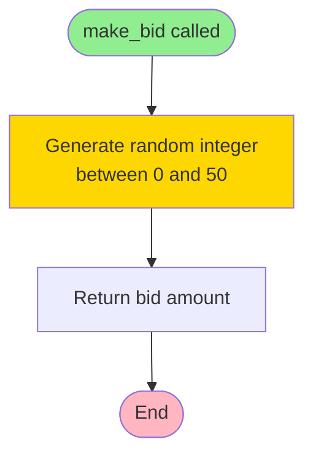

# Agent Architecture and Decision-Making

Complete documentation of all agent types, their creation, decision-making processes, and implementation details.

## Table of Contents

1. [Agent Base Class](#agent-base-class)
2. [Random Agent](#1-random-agent)
3. [Fixed Agent](#2-fixed-agent)
4. [Reflex Agent](#3-reflex-agent)
5. [Reflex Agent with Memory](#4-reflex-agent-with-memory)
6. [Agent Comparison](#agent-comparison)
7. [Creating Custom Agents](#creating-custom-agents)

---

## Agent Base Class

All agents inherit from the base `Agent` class defined in `src/libs/agent.py`.

### Class Structure

```python
class Agent:
    def __init__(self, name)
    def receive_hand(self, hand)
    def make_bid(self, phase, own_bids, opponent_bids)
    def observe_showdown(self, opponent_hand)
```

### Key Methods

- **`receive_hand(hand)`**: Called by the game engine when cards are dealt. Stores the agent's hand for the current hand.
- **`make_bid(phase, own_bids, opponent_bids)`**: **Must be implemented by subclasses**. Returns an integer bid amount ($0-50).
- **`observe_showdown(opponent_hand)`**: Optional method called after showdown. Can be used for learning from past games.

### Agent Lifecycle

```
Game Start
    ↓
receive_hand(hand)  ← Agent receives 3 cards
    ↓
make_bid(phase=1, own_bids=[], opponent_bids=[])  ← Phase 1 bidding
    ↓
make_bid(phase=2, own_bids=[bid1], opponent_bids=[opp_bid1])  ← Phase 2 bidding
    ↓
make_bid(phase=3, own_bids=[bid1, bid2], opponent_bids=[opp_bid1, opp_bid2])  ← Phase 3 bidding
    ↓
observe_showdown(opponent_hand)  ← Learn from opponent's revealed hand
    ↓
Next Hand (repeat)
```

---

## 1. Random Agent

**File**: `src/lab_2a.py`
**Factory Function**: `create_random_agent(name)`

### Overview

The Random Agent is the simplest baseline agent. It makes completely random bidding decisions without considering any information.

### Creation

```python
from lab_2a import create_random_agent

agent = create_random_agent("Random Agent")
```

### Decision-Making Flow



### Implementation

```python
class RandomAgent(Agent):
    def make_bid(self, phase, own_bids, opponent_bids):
        return random.randint(0, 50)
```

### Characteristics

- **Information Used**: None
- **Bid Range**: $0-$50 (uniform distribution)
- **Average Bid**: ~$25 per phase
- **Total Bid per Hand**: ~$75 (3 phases × $25)
- **Predictability**: Completely unpredictable
- **Use Case**: Baseline for comparison

### Decision Factors

| Factor | Considered? | Impact |
|--------|------------|--------|
| Hand strength | ❌ No | None |
| Opponent bids | ❌ No | None |
| Phase number | ❌ No | None |
| Own previous bids | ❌ No | None |

---

## 2. Fixed Agent

**File**: `src/lab_2b.py`
**Factory Function**: `create_fixed_agent(name, fixed_bid_amount=25)`

### Overview

The Fixed Agent always bids the same amount in every phase, regardless of any circumstances. This provides a predictable baseline strategy.

### Creation

```python
from lab_2b import create_fixed_agent

# Default: bids $25 per phase
agent = create_fixed_agent("Fixed Agent")

# Custom: bids $30 per phase
agent = create_fixed_agent("Fixed Agent", fixed_bid_amount=30)
```

### Decision-Making Flow


### Implementation

```python
class FixedAgent(Agent):
    def __init__(self, name, fixed_bid):
        super().__init__(name)
        self.fixed_bid = max(0, min(50, fixed_bid))  # Clamp to 0-50

    def make_bid(self, phase, own_bids, opponent_bids):
        return self.fixed_bid
```

### Characteristics

- **Information Used**: None
- **Bid Range**: Fixed amount (default: $25)
- **Bid per Phase**: Always the same (e.g., $25)
- **Total Bid per Hand**: Fixed amount × 3 (e.g., $75)
- **Predictability**: Completely predictable
- **Use Case**: Baseline for comparison, demonstrates consistency

### Decision Factors

| Factor | Considered? | Impact |
|--------|------------|--------|
| Hand strength | ❌ No | None |
| Opponent bids | ❌ No | None |
| Phase number | ❌ No | None |
| Own previous bids | ❌ No | None |
| Fixed bid amount | ✅ Yes | Determines all bids |

---

## 3. Reflex Agent

**File**: `src/lab_2e.py`
**Factory Function**: `create_reflex_agent(name)`

### Overview

The Reflex Agent makes decisions based on its own hand strength. It evaluates the hand and bids proportionally to the hand's strength.

### Creation

```python
from lab_2e import create_reflex_agent

agent = create_reflex_agent("Reflex Agent")
```

### Decision-Making Flow

```mermaid
flowchart TD
    Start([make_bid called]) --> CheckHand{Hand<br/>received?}
    CheckHand -->|No| Return0[Return $0]
    CheckHand -->|Yes| Evaluate[Evaluate hand strength<br/>using analyse_hand]

    Evaluate --> Calculate[Calculate bid:<br/>bid = hand_score / 39 * 50]
    Calculate --> Clamp[Clamp to range [0, 50]]
    Clamp --> Return[Return bid amount]

    Return0 --> End([End])
    Return --> End

    style Start fill:#90EE90
    style End fill:#FFB6C1
    style Evaluate fill:#87CEEB
    style Calculate fill:#FFD700
```

### Implementation

```python
class ReflexAgent(Agent):
    def make_bid(self, phase, own_bids, opponent_bids):
        if self.hand is None:
            return 0

        # Evaluate hand strength (score ranges from 1-39)
        hand_score = analyse_hand(self.hand)

        # Map hand score (1-39) to bid amount (0-50)
        # Linear scaling: stronger hands bid more
        bid = int((hand_score / 39.0) * 50)

        # Ensure bid is within valid range [0, 50]
        bid = max(0, min(50, bid))

        return bid
```

### Hand Strength Scoring

Hand scores range from **1-39**:

| Hand Type | Score Range | Example Scores |
|-----------|-------------|----------------|
| High Card | 1-13 | 2♠ 5♥ K♣ → Score: 12 (King) |
| Pair | 14-26 | 5♠ 5♥ 2♣ → Score: 18 (Pair of 5s) |
| Three of a Kind | 27-39 | 7♠ 7♥ 7♣ → Score: 33 (Three 7s) |

### Bidding Formula

```
bid = (hand_score / 39) × 50
```

### Bidding Ranges by Hand Strength

| Hand Strength | Score Range | Bid Range | Example |
|---------------|-------------|-----------|---------|
| Weak | 1-13 | $1-$16 | High card: 2♠ 3♥ 4♣ → Score: 4 → Bid: $5 |
| Medium | 14-26 | $18-$33 | Pair: 5♠ 5♥ 2♣ → Score: 18 → Bid: $23 |
| Strong | 27-39 | $35-$50 | Three of a kind: 7♠ 7♥ 7♣ → Score: 33 → Bid: $42 |

### Characteristics

- **Information Used**: Own hand strength
- **Bid Range**: $0-$50 (proportional to hand strength)
- **Average Bid**: Varies based on hand distribution
- **Predictability**: Predictable based on hand strength
- **Use Case**: Demonstrates value of using available information

### Decision Factors

| Factor | Considered? | Impact |
|--------|------------|--------|
| Hand strength | ✅ Yes | Primary factor - determines bid amount |
| Opponent bids | ❌ No | None |
| Phase number | ❌ No | None |
| Own previous bids | ❌ No | None |

### Example Bids

```python
# Weak hand: ["2s", "3h", "4c"]
hand_score = 4  # High card (4 is highest)
bid = (4 / 39) * 50 = $5

# Medium hand: ["5s", "5h", "2c"]
hand_score = 18  # Pair of 5s
bid = (18 / 39) * 50 = $23

# Strong hand: ["As", "Ah", "Ac"]
hand_score = 39  # Three Aces (strongest)
bid = (39 / 39) * 50 = $50
```

---

## 4. Reflex Agent with Memory

**File**: `src/lab_2f.py`
**Factory Function**: `create_reflex_agent_with_memory(name)`

### Overview

The Reflex Agent with Memory extends the Reflex Agent by considering opponent bidding behavior. It uses a sophisticated adjustment strategy that:
1. Starts with a base bid from hand strength (like Reflex Agent)
2. Adjusts based on opponent's last bid using proportional adjustments
3. Scales adjustments based on confidence (hand strength)

### Creation

```python
from lab_2f import create_reflex_agent_with_memory

agent = create_reflex_agent_with_memory("Reflex Agent (Memory)")
```

### Decision-Making Flow

```mermaid
flowchart TD
    Start([make_bid called]) --> CheckHand{Hand<br/>received?}
    CheckHand -->|No| Return0[Return $0]
    CheckHand -->|Yes| Evaluate[Evaluate hand strength<br/>hand_score = analyse_hand]

    Evaluate --> BaseBid[Calculate base bid:<br/>base_bid = hand_score / 39 * 50]

    BaseBid --> CheckOpp{Opponent has<br/>previous bids?}

    CheckOpp -->|No| NoAdjust[No adjustment<br/>adjustment = 0]
    CheckOpp -->|Yes| GetLast[Get last opponent bid]

    GetLast --> Expected[Calculate expected bid<br/>expected = 25.0]
    Expected --> Diff[Calculate difference:<br/>diff = opponent_bid - expected]

    Diff --> Confidence[Calculate confidence:<br/>confidence = hand_score - 1 / 38]
    Confidence --> Factor[Calculate adjustment factor:<br/>factor = diff / 25.0]

    Factor --> Multiplier[Calculate confidence multiplier:<br/>multiplier = 0.5 + confidence * 1.0]

    Multiplier --> Adjust[Calculate adjustment:<br/>adjustment = -factor * 15 * multiplier]

    Adjust --> Apply[Apply adjustment:<br/>bid = base_bid + adjustment]
    NoAdjust --> Apply

    Apply --> Clamp[Clamp to range [0, 50]]
    Clamp --> Return[Return bid amount]

    Return0 --> End([End])
    Return --> End

    style Start fill:#90EE90
    style End fill:#FFB6C1
    style Evaluate fill:#87CEEB
    style BaseBid fill:#FFD700
    style Adjust fill:#FFA500
    style Confidence fill:#DDA0DD
```

### Implementation

```python
class ReflexAgentWithMemory(Agent):
    def make_bid(self, phase, own_bids, opponent_bids):
        if self.hand is None:
            return 0

        # Evaluate hand strength (score ranges from 1-39)
        hand_score = analyse_hand(self.hand)

        # Base bid from hand strength (same as Reflex Agent)
        base_bid = (hand_score / 39.0) * 50

        # Adjust based on opponent's last bid (if available)
        adjustment = 0
        if opponent_bids:  # If opponent has bid in previous phases
            last_opponent_bid = opponent_bids[-1]

            # Calculate expected opponent bid
            expected_opponent_bid = 25.0  # Average expected bid

            # Calculate the difference between opponent bid and expected bid
            bid_difference = last_opponent_bid - expected_opponent_bid

            # Calculate confidence based on hand strength
            # Normalize hand strength to [0, 1] range (1-39 -> 0-1)
            confidence = (hand_score - 1) / 38.0  # Maps 1->0, 39->1

            # Proportional adjustment based on bid difference
            base_adjustment_factor = bid_difference / 25.0  # Normalize to [-1, 1] range

            # Apply confidence multiplier: higher confidence = more aggressive adjustment
            confidence_multiplier = 0.5 + (confidence * 1.0)  # Ranges from 0.5 to 1.5

            # Calculate proportional adjustment
            # Negative bid_difference (opponent bid low) -> positive adjustment (we bid more)
            # Positive bid_difference (opponent bid high) -> negative adjustment (we bid less)
            max_adjustment = 15.0  # Maximum adjustment amount
            adjustment = -base_adjustment_factor * max_adjustment * confidence_multiplier

        # Apply adjustment
        bid = base_bid + adjustment

        # Ensure bid is within valid range [0, 50]
        bid = max(0, min(50, int(bid)))

        return bid
```

### Adjustment Strategy

The agent uses a **sophisticated proportional adjustment strategy**:

#### 1. Base Bid Calculation
```
base_bid = (hand_score / 39) × 50
```
Same as Reflex Agent - proportional to hand strength.

#### 2. Expected Opponent Bid
```
expected_opponent_bid = 25.0
```
Based on average hand strength (~20) → average bid (~$25).

#### 3. Bid Difference
```
bid_difference = opponent_bid - expected_opponent_bid
```
- **Positive**: Opponent bid higher than expected (might have strong hand)
- **Negative**: Opponent bid lower than expected (might have weak hand)

#### 4. Confidence Calculation
```
confidence = (hand_score - 1) / 38.0
```
- **Weak hand** (score 1): confidence = 0.0
- **Medium hand** (score 20): confidence = 0.5
- **Strong hand** (score 39): confidence = 1.0

#### 5. Confidence Multiplier
```
confidence_multiplier = 0.5 + (confidence × 1.0)
```
- **Weak hand**: multiplier = 0.5 (cautious adjustments)
- **Strong hand**: multiplier = 1.5 (aggressive adjustments)

#### 6. Adjustment Calculation
```
adjustment = -(bid_difference / 25.0) × max_adjustment × confidence_multiplier
```
Where `max_adjustment = 15.0`

**Adjustment Logic**:
- If opponent bid **low** (below $25): **positive adjustment** → bid more aggressively
- If opponent bid **high** (above $25): **negative adjustment** → bid more cautiously
- Adjustment magnitude scales with:
  - How much opponent deviates from expected ($25)
  - Own hand strength confidence

### Example Calculations

#### Example 1: Strong Hand, Opponent Bid Low
```
hand_score = 35 (strong hand)
base_bid = (35 / 39) × 50 = $45
opponent_bid = $15 (low bid)
expected = $25
bid_difference = 15 - 25 = -10
confidence = (35 - 1) / 38 = 0.89
confidence_multiplier = 0.5 + (0.89 × 1.0) = 1.39
adjustment = -(-10 / 25) × 15 × 1.39 = +8.34
final_bid = 45 + 8.34 = $53 → clamped to $50
```

#### Example 2: Weak Hand, Opponent Bid High
```
hand_score = 8 (weak hand)
base_bid = (8 / 39) × 50 = $10
opponent_bid = $40 (high bid)
expected = $25
bid_difference = 40 - 25 = +15
confidence = (8 - 1) / 38 = 0.18
confidence_multiplier = 0.5 + (0.18 × 1.0) = 0.68
adjustment = -(15 / 25) × 15 × 0.68 = -6.12
final_bid = 10 - 6.12 = $4
```

#### Example 3: Medium Hand, Opponent Bid Average
```
hand_score = 20 (medium hand)
base_bid = (20 / 39) × 50 = $26
opponent_bid = $25 (average bid)
expected = $25
bid_difference = 25 - 25 = 0
adjustment = 0
final_bid = $26
```

### Characteristics

- **Information Used**: Own hand strength + opponent's last bid
- **Bid Range**: $0-$50 (base bid + adjustment)
- **Adjustment Range**: ±$15 (scaled by confidence)
- **Predictability**: Adaptive based on opponent behavior
- **Use Case**: Demonstrates value of opponent observation

### Decision Factors

| Factor | Considered? | Impact |
|--------|------------|--------|
| Hand strength | ✅ Yes | Primary factor - determines base bid and confidence |
| Opponent bids | ✅ Yes | Secondary factor - determines adjustment |
| Phase number | ❌ No | None (only uses last opponent bid) |
| Own previous bids | ❌ No | None |
| Confidence | ✅ Yes | Scales adjustment aggressiveness |

### Key Features

1. **Proportional Adjustments**: Adjustment scales with how much opponent deviates from expected bid
2. **Confidence-Based Scaling**: Stronger hands adjust more aggressively
3. **Bidirectional Logic**:
   - Low opponent bid → increase bid (capitalize on weakness)
   - High opponent bid → decrease bid (avoid overcommitting)

---

## Agent Comparison

### Information Usage

| Agent | Hand Strength | Opponent Bids | Phase | Previous Bids |
|-------|--------------|---------------|-------|---------------|
| Random | ❌ | ❌ | ❌ | ❌ |
| Fixed | ❌ | ❌ | ❌ | ❌ |
| Reflex | ✅ | ❌ | ❌ | ❌ |
| Reflex+Memory | ✅ | ✅ | ❌ | ❌ |

### Strategy Complexity

```
Random < Fixed < Reflex < Reflex+Memory
```

### Performance (Typical Results)

| Agent | vs Random | vs Fixed | vs Reflex |
|-------|-----------|----------|-----------|
| Random | - | ~$0 | -$400 to -$600 |
| Fixed | ~$0 | - | -$400 to -$600 |
| Reflex | +$400 to +$600 | +$400 to +$600 | - |
| Reflex+Memory | +$450 to +$650 | +$450 to +$650 | +$60 to +$100 |

### Decision-Making Complexity

| Agent | Lines of Code | Decision Steps | Calculations |
|-------|--------------|----------------|--------------|
| Random | 1 | 1 | 1 (random) |
| Fixed | 1 | 1 | 0 (return stored) |
| Reflex | ~10 | 3 | 2 (evaluate, calculate) |
| Reflex+Memory | ~50 | 8+ | 7+ (evaluate, base, diff, confidence, factor, multiplier, adjustment) |

---

## Creating Custom Agents

### Template

```python
from libs.agent import Agent
from libs.hand_evaluation import analyse_hand

def create_custom_agent(name):
    """
    Create a custom agent.

    Parameters
    ----------
    name : str
        Name of the agent

    Returns
    -------
    Agent
        A CustomAgent instance
    """
    class CustomAgent(Agent):
        """Description of your agent."""

        def make_bid(self, phase, own_bids, opponent_bids):
            """
            Make a bid decision.

            Parameters
            ----------
            phase : int
                Current bidding phase (1, 2, or 3)
            own_bids : list
                List of own previous bids
            opponent_bids : list
                List of opponent's previous bids

            Returns
            -------
            int : bid amount ($0-50)
            """
            # Your decision logic here
            bid = 25  # Example

            # Ensure bid is within valid range [0, 50]
            bid = max(0, min(50, int(bid)))

            return bid

        def observe_showdown(self, opponent_hand):
            """
            Observe opponent's hand during showdown phase.

            Optional: Use this to learn from past games.
            """
            # Your learning logic here
            pass

    return CustomAgent(name)
```

### Available Information

When `make_bid()` is called, you have access to:

- **`self.hand`**: List of 3 cards (e.g., `["As", "Kh", "Qc"]`)
- **`phase`**: Current phase (1, 2, or 3)
- **`own_bids`**: List of your previous bids (e.g., `[25, 30]` for phase 3)
- **`opponent_bids`**: List of opponent's previous bids (e.g., `[20, 35]` for phase 3)

### Helper Functions

```python
from libs.hand_evaluation import analyse_hand, identify_hand

# Evaluate hand strength (returns 1-39)
hand_score = analyse_hand(self.hand)

# Identify hand type and rank (returns tuple)
hand_type, rank_value = identify_hand(self.hand)
# hand_type: "high_card", "pair", or "three_of_a_kind"
# rank_value: 1-13 (2=1, 3=2, ..., A=13)
```

### Example: Phase-Aware Agent

```python
class PhaseAwareAgent(Agent):
    def make_bid(self, phase, own_bids, opponent_bids):
        if self.hand is None:
            return 0

        hand_score = analyse_hand(self.hand)
        base_bid = (hand_score / 39.0) * 50

        # Increase bid in later phases
        phase_multiplier = 0.8 + (phase * 0.1)  # 0.9, 1.0, 1.1
        bid = base_bid * phase_multiplier

        return max(0, min(50, int(bid)))
```

### Example: Learning Agent

```python
class LearningAgent(Agent):
    def __init__(self, name):
        super().__init__(name)
        self.opponent_patterns = {}  # Track opponent behavior

    def make_bid(self, phase, own_bids, opponent_bids):
        # Use learned patterns
        if opponent_bids:
            avg_opponent_bid = sum(opponent_bids) / len(opponent_bids)
            # Adjust based on learned patterns
            ...
        return bid

    def observe_showdown(self, opponent_hand):
        # Learn from opponent's hand
        opponent_score = analyse_hand(opponent_hand)
        # Update patterns based on what opponent bid vs actual hand strength
        ...
```

---

## Summary

### Quick Reference

| Agent | Key Feature | Best Use Case |
|-------|-------------|--------------|
| **Random** | Pure randomness | Baseline comparison |
| **Fixed** | Consistent bidding | Baseline comparison |
| **Reflex** | Hand strength-based | Demonstrates information value |
| **Reflex+Memory** | Hand + opponent observation | Demonstrates adaptive strategies |

### Decision-Making Summary

1. **Random**: `random.randint(0, 50)`
2. **Fixed**: `return fixed_bid`
3. **Reflex**: `(hand_score / 39) × 50`
4. **Reflex+Memory**: `base_bid + proportional_adjustment × confidence_multiplier`

---

For more details on the game structure and rules, see [GAME_STRUCTURE.md](GAME_STRUCTURE.md).
For code architecture details, see [CODE_FLOW.md](CODE_FLOW.md).

