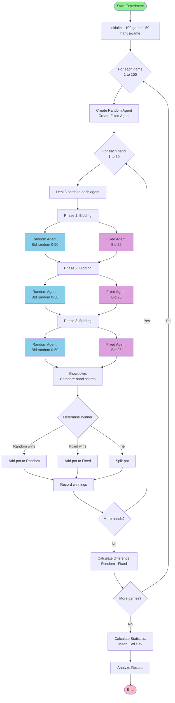
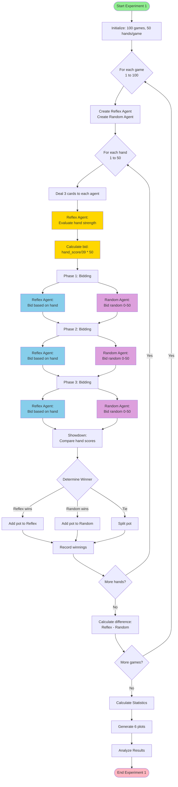
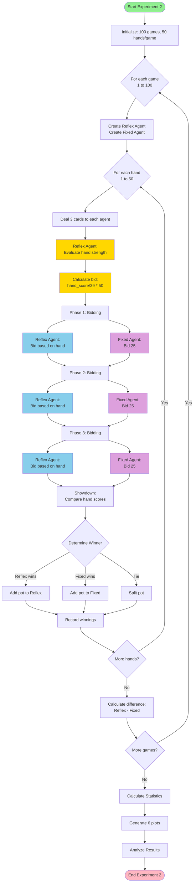
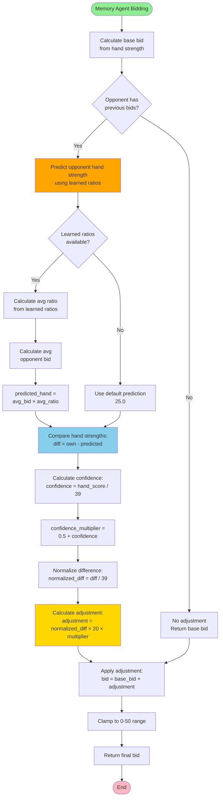
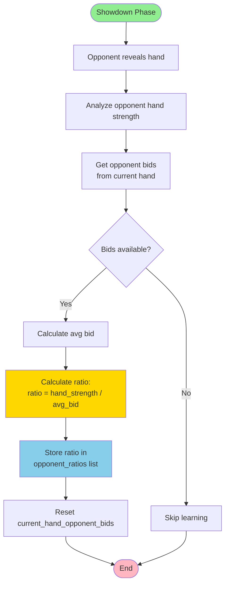
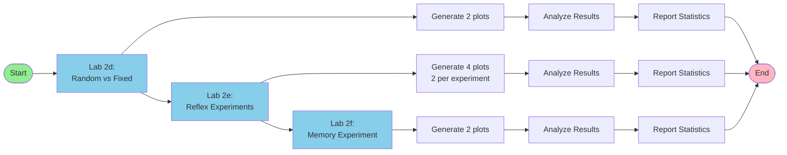

# Flow Diagrams

Visual flowcharts for each lab experiment.

## Lab 2d: Random vs Fixed Agent Comparison

---

## Lab 2e: Reflex Agent Experiments

### Experiment 1: Reflex vs Random

### Experiment 2: Reflex vs Fixed

---

## Lab 2f: Reflex Agent with Memory vs Without Memory

```mermaid
flowchart TD
    Start([Start Experiment]) --> Init[Initialize: 100 games, 50 hands/game]
    Init --> GameLoop{For each game<br/>1 to 100}

    GameLoop --> CreateAgents[Create Reflex Agent with Memory<br/>Create Reflex Agent without Memory]
    CreateAgents --> HandLoop{For each hand<br/>1 to 50}

    HandLoop --> Deal[Deal 3 cards to each agent]
    Deal --> EvalBoth[Both agents:<br/>Evaluate hand strength]

    EvalBoth --> CalcBaseBoth[Both calculate base bid:<br/>hand_score/39 * 50]

    CalcBaseBoth --> Phase1[Phase 1: Bidding]
    Phase1 --> Memory1[Memory Agent:<br/>Base bid + adjustment]
    Phase1 --> NoMemory1[No Memory Agent:<br/>Base bid only]

    Memory1 --> CheckOpp1{Opponent bid<br/>available?}
    CheckOpp1 -->|Yes| Adjust1[Adjust based on<br/>opponent bid]
    CheckOpp1 -->|No| NoAdjust1[No adjustment]
    Adjust1 --> Phase2[Phase 2: Bidding]
    NoAdjust1 --> Phase2

    NoMemory1 --> Phase2
    Phase2 --> Memory2[Memory Agent:<br/>Base bid + adjustment]
    Phase2 --> NoMemory2[No Memory Agent:<br/>Base bid only]

    Memory2 --> CheckOpp2{Opponent bid<br/>available?}
    CheckOpp2 -->|Yes| Adjust2[Adjust based on<br/>opponent bid]
    CheckOpp2 -->|No| NoAdjust2[No adjustment]
    Adjust2 --> Phase3[Phase 3: Bidding]
    NoAdjust2 --> Phase3

    NoMemory2 --> Phase3
    Phase3 --> Memory3[Memory Agent:<br/>Base bid + adjustment]
    Phase3 --> NoMemory3[No Memory Agent:<br/>Base bid only]

    Memory3 --> CheckOpp3{Opponent bid<br/>available?}
    CheckOpp3 -->|Yes| Adjust3[Adjust based on<br/>opponent bid]
    CheckOpp3 -->|No| NoAdjust3[No adjustment]
    Adjust3 --> Showdown[Showdown:<br/>Compare hand scores]
    NoAdjust3 --> Showdown

    NoMemory3 --> Showdown

    Showdown --> Winner{Determine Winner}
    Winner -->|Memory wins| AddMemory[Add pot to Memory]
    Winner -->|No Memory wins| AddNoMemory[Add pot to No Memory]
    Winner -->|Tie| SplitPot[Split pot]

    AddMemory --> Record[Record winnings]
    AddNoMemory --> Record
    SplitPot --> Record

    Record --> CheckHand{More hands?}
    CheckHand -->|Yes| HandLoop
    CheckHand -->|No| CalcDiff[Calculate difference:<br/>Memory - No Memory]

    CalcDiff --> CheckGame{More games?}
    CheckGame -->|Yes| GameLoop
    CheckGame -->|No| Stats[Calculate Statistics]

    Stats --> Plots[Generate 6 plots]
    Plots --> Analysis[Analyze Results]
    Analysis --> End([End])

    style Start fill:#90EE90
    style End fill:#FFB6C1
    style EvalBoth fill:#FFD700
    style CalcBaseBoth fill:#FFD700
    style Adjust1 fill:#FFA500
    style Adjust2 fill:#FFA500
    style Adjust3 fill:#FFA500
    style Memory1 fill:#87CEEB
    style Memory2 fill:#87CEEB
    style Memory3 fill:#87CEEB
    style NoMemory1 fill:#DDA0DD
    style NoMemory2 fill:#DDA0DD
    style NoMemory3 fill:#DDA0DD
```

---

## Memory Agent Adjustment Logic

## Memory Agent Learning Logic

---

## Overall Experiment Flow

---

## Note on Diagrams

These diagrams use Mermaid syntax. To view them:
- GitHub automatically renders Mermaid diagrams
- Use online Mermaid editors: https://mermaid.live/
- VS Code with Mermaid extension
- Many markdown viewers support Mermaid

For ASCII-style diagrams, see the code comments in each lab file.

